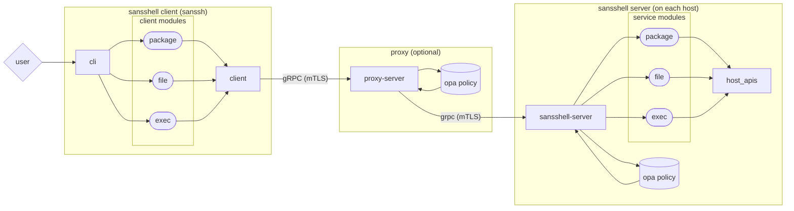

# SansShell

[](https://github.com/Snowflake-Labs/sansshell/actions?query=workflow%3A%22Build+and+Test%22)
[](https://github.com/Snowflake-Labs/sansshell/blob/main/LICENSE)
[](https://pkg.go.dev/github.com/Snowflake-Labs/sansshell)
[](https://goreportcard.com/report/github.com/Snowflake-Labs/sansshell)

**A secure, non-interactive daemon for remote host management and debugging**

SansShell is a powerful remote host management system built on gRPC that provides a secure alternative to traditional SSH-based administration. It offers fine-grained access control, comprehensive auditing, and policy-based authorization for critical system operations.



## Overview

SansShell is a modern host management platform that replaces traditional interactive shell access with a secure, auditable, and policy-driven approach. Built entirely on gRPC, it provides:

- **Security First**: mTLS encryption, certificate-based authentication, and OPA policy enforcement
- **Fine-grained Authorization**: Every operation can be evaluated against custom policies
- **Comprehensive Auditing**: All actions are logged and traceable
- **Deterministic Operations**: Reproducible results for a given system state
- **Zero Trust Architecture**: No persistent shell access or elevated privileges required

### Core Components

**SansShell Server (`sansshell-server`)**: A non-interactive daemon that runs on managed hosts, exposing secure gRPC services for system operations.

**SansShell Client (`sanssh`)**: A CLI tool that provides both user-friendly commands and direct access to all gRPC endpoints.

**Proxy Server (`proxy-server`)** *(Optional)*: A centralized gateway that enables:
- Request fan-out to multiple hosts
- Centralized policy enforcement
- Network connectivity bridging
- Enhanced logging and monitoring

## Getting Started

### Prerequisites

- **Go 1.21+** (check `go.mod` for exact version requirements)
- **Protocol Buffers compiler** (`protoc`) version 3+
- **TLS certificates** for mTLS authentication

### Quick Start

1. **Set up certificates** (for development/testing):
   ```bash
   cp -r auth/mtls/testdata ~/.sansshell
   ```

2. **Run the server**:
   ```bash
   go run ./cmd/sansshell-server
   ```

3. **Test with the client**:
   ```bash
   go run ./cmd/sanssh --targets=localhost file read /etc/hosts
   ```

### Full Proxy Setup

For production-like testing with the proxy:

```bash
# Terminal 1: Start the server
go run ./cmd/sansshell-server

# Terminal 2: Start the proxy
go run ./cmd/proxy-server

# Terminal 3: Use client through proxy
go run ./cmd/sanssh --proxy=localhost:50043 --targets=localhost:50042 file read /etc/hosts
```

### Monitoring and Debugging

- **Server Debug UI**: http://localhost:50044
- **Proxy Debug UI**: http://localhost:50046  
- **Metrics Endpoint**: http://localhost:50047 (server), http://localhost:50046 (proxy)

### Environment setup : protoc

When making any change to the protocol buffers, you'll also need the protocol
buffer compiler (`protoc`) (version 3 or above) as well as the protoc plugins
for Go and Go-GRPC

On MacOS, the protocol buffer can be installed via homebrew using

```
brew install protobuf
```

On Linux, protoc can be installed using either the OS package manager, or by
directly installing a release version from the [protocol buffers github][1]

### Environment setup : protoc plugins

On any platform, once protoc has been installed, you can install the required
code generation plugins using `go install`.

```
$ go install google.golang.org/protobuf/cmd/protoc-gen-go
$ go install google.golang.org/grpc/cmd/protoc-gen-go-grpc
$ go install github.com/Snowflake-Labs/sansshell/proxy/protoc-gen-go-grpcproxy
```

Note that, you'll need to make certain that your `PATH` includes the gobinary
directory (either the value of `$GOBIN`, or, if unset, `$HOME/go/bin`)

The `tools.go` file contains helpful `go generate` directives which will
do this for you, as well as re-generating the service proto files.

```
$ go generate tools.go
```

### Dev Environment setup
#### Required tools
- [pre-commit 3.8.0+](https://pre-commit.com/index.html)
- [golangci-lint 1.59.1+](https://golangci-lint.run/welcome/install/#local-installation)

Configuration:
- Set up git pre-commit hooks
```bash
pre-commit install
```

### Creating your own certificates

As an alternative to copying auth/mtls/testdata, you can create your own example mTLS certs. See the
[mtls testdata readme](/auth/mtls/testdata/README.md) for steps.

### Debugging

Reflection is included in the RPC servers (proxy and sansshell-server)
allowing for the use of [grpc_cli](https://github.com/grpc/grpc/blob/master/doc/command_line_tool.md).

If you are using the certificates from above in ~/.sansshell invoking
grpc_cli requires some additional flags for local testing:

```
$ GRPC_DEFAULT_SSL_ROOTS_FILE_PATH=$HOME/.sansshell/root.pem grpc_cli \
  --ssl_client_key=$HOME/.sansshell/client.key --ssl_client_cert=$HOME/.sansshell/client.pem \
  --ssl_target=127.0.0.1 --channel_creds_type=ssl ls 127.0.0.1:50043
```

NOTE: This connects to the proxy. Change to 50042 if you want to connect to the sansshell-server.

### Testing
To run unit tests, run the following command:
```bash
go test ./...
```

To run integration tests, run the following command:
```bash
# Run go integration tests
INTEGRATION_TEST=yes go test -run "^TestIntegration.*$" ./...

# Run bash integration tests
./test/integration.sh
```

#### Integration testing
To implement integration tests, you need to:
- Create a new test file name satisfy pattern `<file-name>_integration_test.go`
- Name test functions satisfy pattern `TestIntegration<FunctionName>`
- Add check to skip tests when unit test is running:
```go
if os.Getenv("INTEGRATION_TEST") == "" {
    t.Skip("skipping integration test")
}
```

## Architecture Overview

SansShell follows a modular, service-oriented architecture with several key components:

### Core Architecture Components

1. **Services Layer** (`services/`): Modular gRPC services that implement specific functionality
2. **Server Runtime** (`server/`): gRPC server framework with authentication, authorization, and service registration
3. **Proxy Layer** (`proxy/`): Optional intermediary for request routing, policy enforcement, and fan-out
4. **Client Library** (`client/`): Go client library for programmatic access
5. **CLI Interface** (`cmd/sanssh/`): User-friendly command-line interface
6. **Authentication** (`auth/`): mTLS and OPA policy-based security framework

### Service Architecture

Each service follows a consistent pattern:

```
services/<service-name>/
├── <service>.proto        # gRPC service definition
├── server/
│   └── server.go         # Service implementation
├── client/
│   └── client.go         # CLI client commands
└── README.md             # Service-specific documentation
```

Services self-register using `services.RegisterSansShellService()` in their `init()` functions, enabling compile-time service selection.

### Services

Services implement at least one gRPC API endpoint, and expose it by calling
`RegisterSansShellService` from `init()`. The goal is to allow custom
implementations of the SansShell Server to easily import services they wish to
use, and have zero overhead or risk from services they do not import at compile
time.

[Here](/docs/services-architecture.md) you could read more about services architecture.

#### Available Services

SansShell provides a comprehensive set of services for system management:

| Service | Description | Key Capabilities |
|---------|-------------|------------------|
| **Ansible** | Execute Ansible playbooks | Local playbook execution with output streaming |
| **DNS** | DNS operations and diagnostics | Query resolution, record lookups |
| **Exec** | Command execution | Secure command execution with output capture |
| **FDB** | FoundationDB management | Database administration and monitoring |
| **File (LocalFile)** | File system operations | Read, write, stat, checksum, permissions, symbolic links, directory operations |
| **HealthCheck** | System health monitoring | Service health verification |
| **HTTP-over-RPC** | HTTP proxy functionality | Secure HTTP requests through gRPC |
| **MPA** | Multi-Party Authorization | Approval workflows for sensitive operations |
| **Network** | Network diagnostics | TCP connectivity checks, network troubleshooting |
| **Packages** | Package management | Install, upgrade, list packages (yum, apt, etc.) |
| **Power** | Power management | System shutdown, reboot operations |
| **Process** | Process management | List processes, stack traces, core dumps, Java heap dumps |
| **Raw** | Low-level system access | Direct system call interface |
| **SansShell** | Core system info | Version information, system metadata |
| **Service** | Service management | SystemD service control (start, stop, restart, enable, disable) |
| **SysInfo** | System information | Hardware and OS details |
| **TLS Info** | TLS certificate management | Certificate inspection and validation |
| **Util** | Utility functions | Common helper operations |
| **WhoAmI** | Identity verification | Current user and permission context |

Each service supports streaming operations where appropriate and includes comprehensive error handling and logging.

#### Services API versioning and OPA policy

In most cases, services APIs evolve in a fully-backward compatible model,
where adding new parameters or behaviors do not cause unintentional
side-effects on authz decisions made by OPA policy.

Now consider a localfile read which accepts a path to a file, for example
`/tmp/test.txt`. If we extend this service to allow reading all files
in a particular directory (through read request with `/tmp/*` as argument)
we may end up allowing to read `/tmp/secret` file which could be explicitly
denied in the OPA policy.

To allow extensions of Sansshell services functions in a safe way we introduced
a notion of `API version` which follows https://semver.org/. A MAJOR version will
be changed each time we add a backward-incompatible change to Sansshell services.

Default version supported by Sanasshell server is set to `1.0.0`, in order to use
features of higher API version you should audit your OPA policy to check if there
are no unintentional side-effects of allowing new Sansshell features.

#### List of current API versions

  - `1.0.0` -- current snapshot of Sansshell API as of
        https://github.com/Snowflake-Labs/sansshell/tree/v1.40.4.
  - `2.0.0` -- allow to read a contents of whole directory  by specifying a trailing
        wildcard, for example `localfile read /tmp/*`.

### The Server class

Most of the logic of instantiating a local SansShell server lives in the
`server` directory. This instantiates a gRPC server, registers the imported
services with that server, and constraints them with the supplied OPA policy.

### The reference Proxy Server binary

There is a reference implementation of a SansShell Proxy Server in
`cmd/proxy-server`, which should be suitable as-written for many use cases.
It's intentionally kept relatively short, so that it can be copied to another
repository and customized by adjusting only the imported services.

### The reference Server binary

There is a reference implementation of a SansShell Server in
`cmd/sansshell-server`, which should be suitable as-written for some use cases.
It's intentionally kept relatively short, so that it can be copied to another
repository and customized by adjusting only the imported services.

### The reference CLI client

There is a reference implementation of a SansShell CLI Client in
`cmd/sanssh`. It provides raw access to each gRPC endpoint, as well
as a way to implement "convenience" commands which chain together a series of
actions.

It also demonstrates how to set up command line completion. To use this, set
the appropriate line in your shell configuration.

```shell
# In .bashrc
complete -C /path/to/sanssh -o dirnames sanssh
# Or in .zshrc
autoload -Uz compinit && compinit
autoload -U +X bashcompinit && bashcompinit
complete -C /path/to/sanssh -o dirnames sanssh
```

## Multi party authorization

MPA, or [multi party authorization](https://en.wikipedia.org/wiki/Multi-party_authorization),
allows guarding sensitive commands behind additional approval. SansShell
supports writing authorization policies that only pass when a command is
approved by additional entities beyond the caller. See
[services/mpa/README.md](/services/mpa/README.md) for details on
implementation and usage.

To try this out in the reference client, run the following commands in parallel
in separate terminals. This will run a server that accepts any command from a
proxy and a proxy that allows MPA requests from the "sanssh" user when approved by the "approver" user.

```bash
# Start the server
go run ./cmd/sansshell-server -server-cert ./auth/mtls/testdata/leaf.pem -server-key ./auth/mtls/testdata/leaf.key
# Start the proxy
go run ./cmd/proxy-server -client-cert ./services/mpa/testdata/proxy.pem -client-key ./services/mpa/testdata/proxy.key -server-cert ./services/mpa/testdata/proxy.pem -server-key ./services/mpa/testdata/proxy.key
# Run a command gated on MPA
go run ./cmd/sanssh -client-cert ./auth/mtls/testdata/client.pem -client-key ./auth/mtls/testdata/client.key -mpa -proxy localhost -targets localhost exec run /bin/echo hello world
# Approve the command above
go run ./cmd/sanssh -client-cert ./services/mpa/testdata/approver.pem -client-key ./services/mpa/testdata/approver.key -proxy localhost -targets localhost mpa approve 53feec22-5447f403-c0e0a419
```

## Extending SansShell

SansShell is built on a principle of "Don't pay for what you don't use". This
is advantageous in both minimizing the resources of SansShell server (binary
size, memory footprint, etc) as well as reducing the security risk of running
it. To accomplish that, all of the SansShell services are independent modules,
which can be optionally included at build time. The reference server and
client provide access to the features of all of the built-in modules, and come
with exposure to all of their potential bugs and bloat.

As a result, we expect most users of SansShell would want to copy a very
minimal set of the code (a handful of lines from the reference client and
server), import only the modules they intend to use, and build their own
derivative of SansShell with more (or less!) functionality.

That same extensibility makes it easy to add additional functionality by
implementing your own module.

To quickly rebuild all binaries you can run:

```
$ go generate build.go
```

and they will be placed in a bin directory (which is ignored by git).

TODO: Add example client and server, building in different SansShell modules.

If you need to edit a proto file (to augment an existing service or
create a new one) you'll need to generate proto outputs.

```
$ go generate tools.go
```

NOTE: tools.go will need to have additions to it if you add new services.

[1]: https://github.com/protocolbuffers/protobuf/releases
