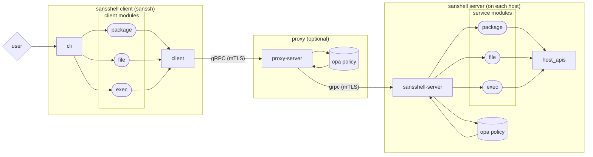

# SansShell

[](https://github.com/Snowflake-Labs/sansshell/actions?query=workflow%3A%22Build+and+Test%229)
[](https://github.com/Snowflake-Labs/sansshell/blob/main/LICENSE)
[](https://pkg.go.dev/github.com/Snowflake-Labs/sansshell)
[](https://goreportcard.com/report/github.com/Snowflake-Labs/sansshell)

A non-interactive daemon for host management



SansShell is primarily a gRPC server with a variety of options for localhost
debugging and management. Its goal is to replace the need to use an
interactive shell for emergency debugging and recovery with a much safer
interface. Each authorized action can be evaluated against an OPA policy,
audited in advance or after the fact, and is ideally deterministic (for a given
state of the local machine).

sanssh is a simple CLI with a friendly API for dumping debugging state and
interacting with a remote machine.  It also includes a set of convenient but
perhaps-less-friendly subcommands to address the raw SansShell API endpoints.

# Getting Started
How to set up, build and run locally for testing.  All commands are relative to
the project root directory.

Building SansShell requires a recent version of Go (check the go.mod file for
the current version).

## Environment setup : protoc

When making any change to the protocol buffers, you'll also need the protocol
buffer compiler (`protoc`) (version 3 or above) as well as the protoc plugins
for Go and Go-GRPC

On MacOS, the protocol buffer can be installed via homebrew using
```
brew install protobuf
```

On Linux, protoc can be installed using either the OS package manager, or by
directly installing a release version from the [protocol buffers github][1]

## Environment setup : protoc plugins.

On any platform, Once protoc has been installed, you can install the required 
code generation plugins using `go install`.

```
$ go install google.golang.org/protobuf/cmd/protoc-gen-go
$ go install google.golang.org/grpc/cmd/protoc-gen-go-grpc
$ go install github.com/Snowflake-Labs/sansshell/proxy/protoc-gen-go-grpcproxy
```

Note that, you'll need to make certain that your `PATH` includes the gobinary
directory (either the value of `$GOBIN`, or, if unset, `$HOME/go/bin`)

The `tools.go` file contains helpful `go generate` directives which will
do this for you, as well as re-generating the service proto files.

```
$ go generate tools.go
```

## Build and run
You only need to do these steps once to configure example mTLS certs:
```
$ go install github.com/meterup/generate-cert@latest
$ mkdir -m 0700 certs
$ cd certs
$ $(go env GOPATH)/bin/generate-cert --host=localhost,127.0.0.1,::1
$ cd ../
$ ln -s $(pwd)/certs ~/.sansshell
```

Or copy the test certificates from auth/mtls/testdata to ~/.sanshell

Then you can build and run the server, in separate terminal windows:
```
$ cd cmd/sansshell-server && go build && ./sansshell-server
$ cd cmd/sanssh && go build && ./sanssh --targets=localhost file read /etc/hosts
```

## Debugging
Reflection is included in the RPC servers (proxy and sansshell-server)
allowing for the use of [grpc_cli](https://github.com/grpc/grpc/blob/master/doc/command_line_tool.md).

If you are using the certificates from above in ~/.sansshell invoking
grpc_cli requires some additional flags for local testing:

```
$ GRPC_DEFAULT_SSL_ROOTS_FILE_PATH=$HOME/.sansshell/root.pem grpc_cli \
  --ssl_client_key=$HOME/.sansshell/client.key --ssl_client_cert=$HOME/.sansshell/client.pem \
  --ssl_target=127.0.0.1 --channel_creds_type=ssl ls 127.0.0.1:50043
```

NOTE: This connects to the proxy. Change to 50042 if you want to connect to the sansshell-server.

# A tour of the codebase
SansShell is composed of 5 primary concepts:
   1. A series of services, which live in the `services/` directory.
   1. A server which wraps these services into a local host agent.
   1. A proxy server which can be used as an entry point to processing sansshell
      RPCs by validating policy and then doing fanout to 1..N actual
      sansshell servers. This can be done as a one to many RPC where
      a single incoming RPC is replicated to N backend hosts in one RPC call.
   1. A reference server binary, which includes all of the services.
   1. A CLI, which serves as the reference implementation of how to use the
      services via the agent.

## Services
Services implement at least one gRPC API endpoint, and expose it by calling
`RegisterSansShellService` from `init()`.  The goal is to allow custom
implementations of the SansShell Server to easily import services they wish to
use, and have zero overhead or risk from services they do not import at compile
time.

### List of available Services:
1. Ansible: Run a local ansible playbook and return output
1. Execute: Execute a command
1. HealthCheck
1. File operations: Read, Write, Stat, Sum, rm/rmdir, chmod/chown/chgrp
   and immutable operations (if OS supported).
1. Package operations: Install, Upgrade, List, Repolist
1. Process operations: List, Get stacks (native or Java), Get dumps (core or Java heap)
1. Service operations: List, Status, Start/stop/restart


TODO: Document service/.../client expectations.

## The Server class
Most of the logic of instantiating a local SansShell server lives in the
`server` directory.  This instantiates a gRPC server, registers the imported
services with that server, and constraints them with the supplied OPA policy.

## The reference Proxy Server binary
There is a reference implementation of a SansShell Proxy Server in
`cmd/proxy-server`, which should be suitable as-written for many use cases.
It's intentionally kept relatively short, so that it can be copied to another
repository and customized by adjusting only the imported services.

## The reference Server binary
There is a reference implementation of a SansShell Server in
`cmd/sansshell-server`, which should be suitable as-written for many use cases.
It's intentionally kept relatively short, so that it can be copied to another
repository and customized by adjusting only the imported services.

## The reference CLI client
There is a reference implementation of a SansShell CLI Client in
`cmd/sanssh`.  It provides raw access to each gRPC endpoint, as well
as a way to implement "convenience" commands which chain together a series of
actions.

# Extending SansShell
SansShell is built on a principle of "Don't pay for what you don't use".  This
is advantageous in both minimizing the resources of SansShell server (binary
size, memory footprint, etc) as well as reducing the security risk of running
it.  To accomplish that, all of the SansShell services are independent modules,
which can be optionally included at build time.  The reference server and
client provide access to the features of all of the built-in modules, and come
with exposure to all of their potential bugs and bloat.

As a result, we expect most users of SansShell would want to copy a very
minimal set of the code (a handful of lines from the reference client and
server), import only the modules they intend to use, and build their own
derivative of SansShell with more (or less!) functionality.

That same extensibility makes it easy to add additional functionality by
implementing your own module.

To quickly rebuild all binaries you can run:
```
$ go generate build.go
```

and they will be placed in a bin directory (which is ignored by git).

TODO: Add example client and server, building in different SansShell modules.

If you need to edit a proto file (to augment an existing service or 
create a new one) you'll need to generate proto outputs.

```
$ go generate tools.go
```

NOTE: tools.go will need to have additions to it if you add new services.

[1]: https://github.com/protocolbuffers/protobuf/releases
