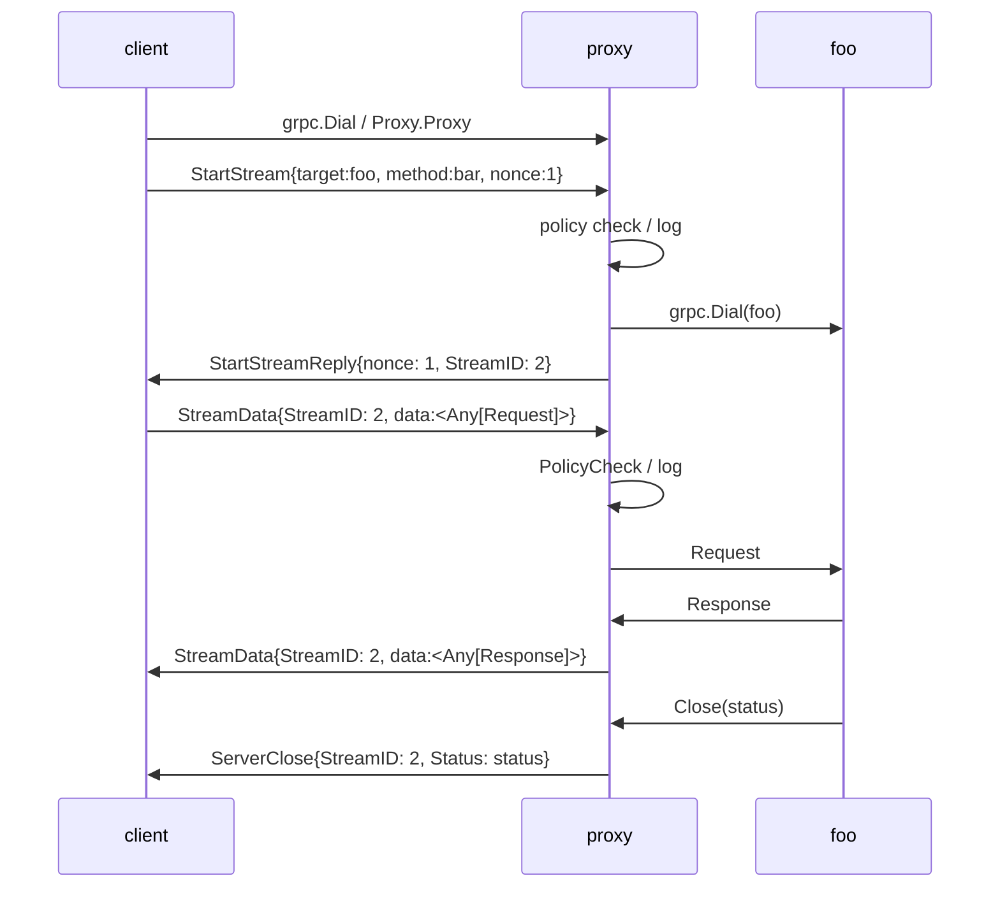

# The Sansshell Proxy

## Overview

The Sansshell proxy is a standalone, optional component from the Sanshell
server, which can be deployed to act as an intermediary between clients
and Sansshell instances.

It is designed to enable larger deployments of Sansshell by providing:
 - a 'gateway' which can bridge connectivity to Sanshell instances to which
  clients may not have network visibility.
 - a centralized 'choke point' for logging and enforcement of fine-grained
  policy that may need to change rapidly.
 - a mechanism for fanning-out identical requests from a single client to
  multiple Sansshell instances, to simplify and accelerate 'batch' operations.

Like Sansshell itself, it is a policy-enforcing gRPC server written in Go.

## Design Goals

The design of the proxy is influenced by the design of Sansshell itself, and
in particular, the ability to extend Sansshell functionality via the implementation
of 'service modules' that provide new capabilities.

Sansshell service modules provides a multitude of different capabilities that are
often best served by a particular calling pattern. For example, a service module
for executing remote commands might naturally fit into a unary call/response
pattern, while a module for reading (potentially large) remote files might instead
be modeled as a stream of data chunks.

Rather than constrain modules to a single pattern in order to fit the needs of the
proxy, it is the proxy itself that endeavors to be flexible enough to accomodate
any potentially calling pattern supported by gRPC (unary, client stream, server
stream, or fully bi-directional streams).

Competing with this desire is the need to support both inspection of the payload,
(for policy enforcement and logging) and the ability to 'fan out' requests to
multiple backend sansshell instances.

## Implementation Notes

The need to support arbitrary gRPC calling conventions yields a client/proxy
protocol which effectively mimics many of the concepts in gRPC itself.

Since at least some portion of the requests served by the proxy will be streaming
(client, server, or both), the client -> proxy connection must itself be a
bidirectional stream.

Further, since we want to be able to fan out requests from a single client to
potentially many different servers, we need to provide the ability to multiplex
the data returned by multiple different instances over the same connection.

At a high-level, this produces a protocol which somewhat resembles 'gRPC over gRPC',
with the client->proxy gRPC connection taking on a similar role as HTTP/2 does
in gRPC itself.

The cost of this flexibility for clients is a somewhat complex implementation,
requiring a proxy-aware client, and a proxy implementation that is capable of
managing the state of many connections.

After establishing a connection to the proxy, clients must explicitly request
the establishment of a 'stream' to each intended target using a 'StartStream'
request, which specifies the intended target and method they wish to call.

Assuming the client has permission (via the policy) to establish the requested
connection, and the target is available, the proxy establishes the connection
to the target, and returns to the client a unique 'stream identifier' which
must be used for future calls. (Note that this stream identifier is only
meanginful in the context of a specific client->proxy connection, and cannot
be used by other clients).

Using the stream id, the clients then send one or more StreamData requests
to the proxy, which in turn sends them to the Sansshell instances that correspond
to the stream ID. Fan-out is provided by the ability to specify multiple
stream IDs in each StreamData request, which causes the request to be delivered
to each of the specified streams.

Clients read from the proxy stream to obtain any responses (whether data 
or errors), each of which is identified by a previously returned stream ID.

Finished streams will cause the delivery of an inband "ServerClose" response
containing the final status of the target stream (again, identified by its
StreamID).

On the proxy, all of the various streams initiated by a clients are 'children'
of the single client -> proxy stream, and will be cancelled automatically
if the client -> proxy stream is itself broken or times out.

The 'low-level' nature of the proxy protocol is helpful for accommodating
multiple gRPC call patterns, but can be somewhat difficult to use as
a result. To help manage the complexity of using the proxy, sansshell also
includes a grpc plugin for generating 'helper' logic for calling a particular
service via the proxy.

This plugin generates new methods on each client stub with a 'OneMany' suffix (e.g. `ReadOneMany` for `Read`) that allow invoking the method (via the proxy) against multiple backend targets. Since the `OneMany` versions also work
for single targets (even if no proxy is used), the Sansshell client code
uses the `OnMany` version of all calls unconditionally.

