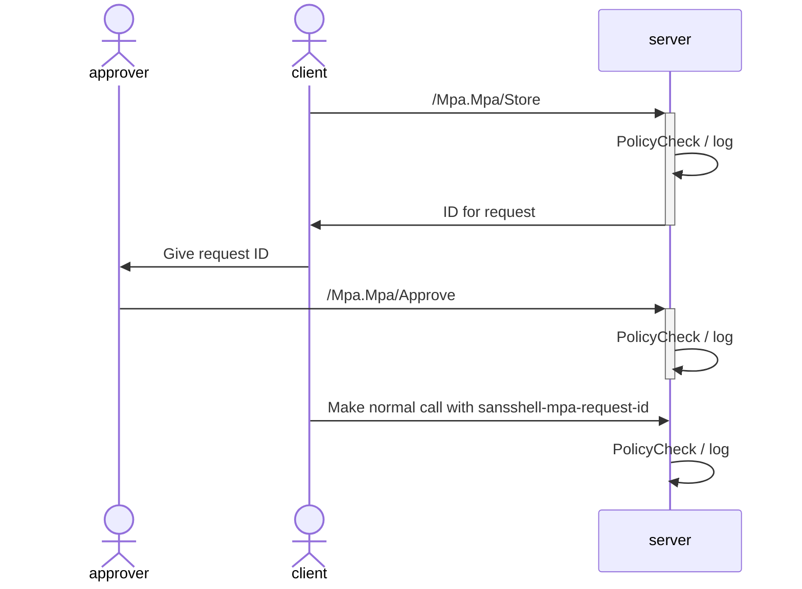
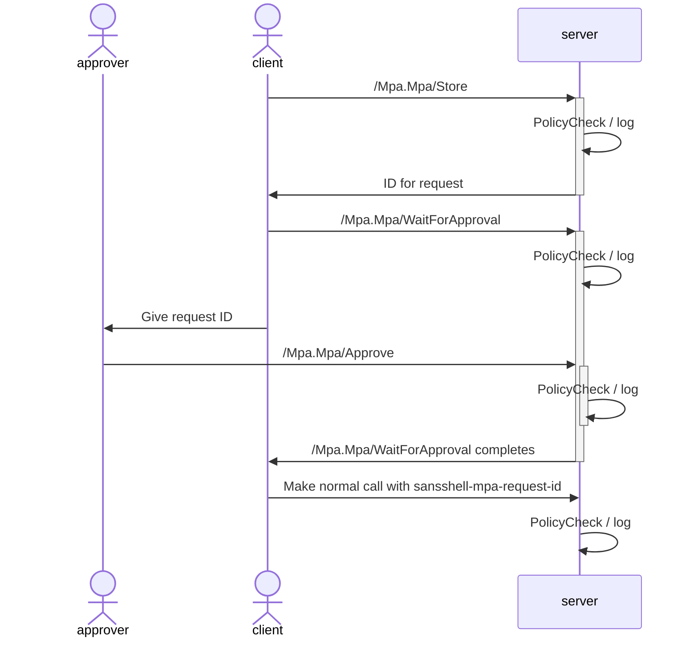
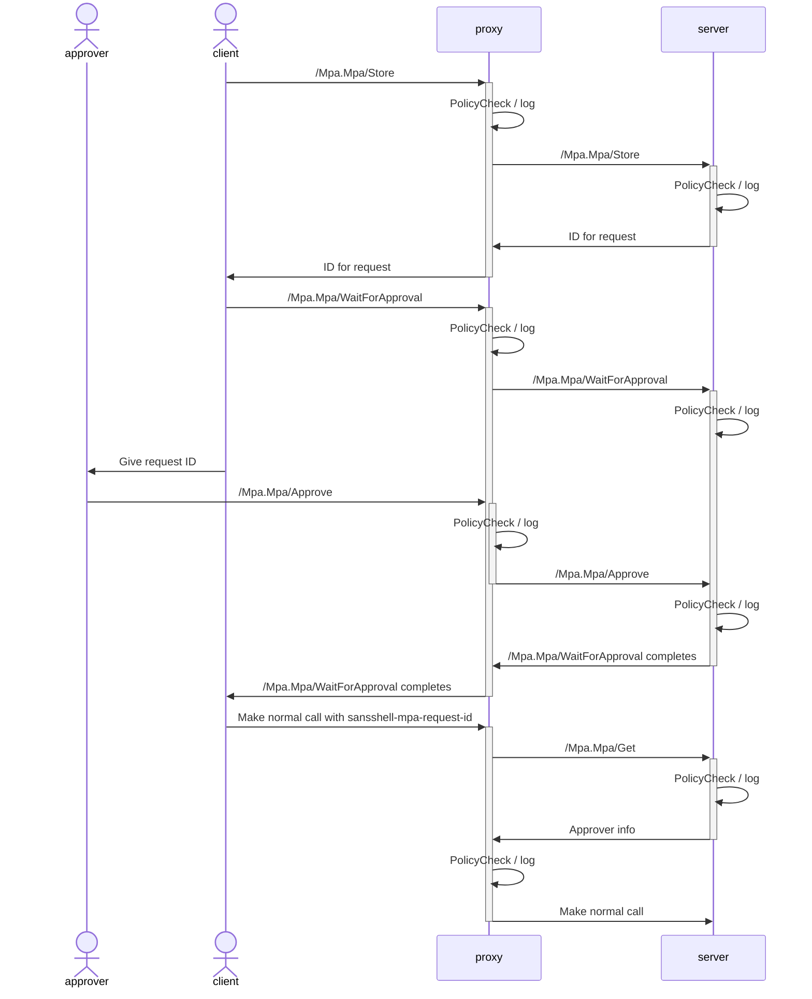

# Multi Party Authorization

This module enables [multi-party authorization](https://en.wikipedia.org/wiki/Multi-party_authorization) for any sansshell command. Approval data is stored in-memory in sansshell-server.

## User flow

MPA must be explicitly requested. When requested, the MPA flow will be used regardless of whether a policy would allow a command without MPA.

1. A user issues commands.

   ```bash
   $ sanssh -mpa -targets=1.2.3.4 -justification emergency exec run /bin/echo hi
   Waiting for multi-party approval on all targets, ask an approver to run:
     sanssh --targets 1.2.3.4 mpa approve 86da6993-a8641390-d687dfc2
   ```

2. The approver views the commands and approves it.

   ```bash
   $ sanssh -targets=1.2.3.4 mpa list
   86da6993-a8641390-d687dfc2
   $ sanssh -targets=1.2.3.4 mpa get 86da6993-a8641390-d687dfc2
   user: firstuser
   justification: emergency
   method: /Exec.Exec/Run
   message: {
      "command": "/bin/echo",
      "args": ["hi"]
   }
   $ sanssh -targets=1.2.3.4 mpa approve 86da6993-a8641390-d687dfc2
   ```

3. If the user's command is still running, it will complete. If the user had stopped their command, they can rerun it and the approval will still be valid as long as the command's input remains the same and the sansshell-server still has the approval in memory. Approvals are lost if the server restarts, if the server evicts the approval due to age or staleness, or if a user calls `sanssh mpa clear` oon the request id.

## Enabling MPA

SansShell is built on a principle of "Don't pay for what you don't use". MPA is a more invasive than the typical sansshell module, so it requires updating more places than most modules. The reference sanssh, sansshell-server, and proxy-server binaries implement these changes.

1. In sanssh, in addition to importing the module to get the `mpa` subcommand, you should conditionally add interceptors when a `-mpa` flag is provided to the cli. This will let other sanssh commands use MPA with the `-mpa` flag and get the user experience mentioned above. There are four interceptors.

   1. Unary interceptor for direct calls
   2. Stream interceptor for direct calls
   3. Unary interceptor for proxied calls
   4. Stream interceptor for proxied calls.

   The interceptors for direct calls get added when dialing out.

   ```go
   proxy.DialContext(ctx, proxy, targets,
      grpc.WithStreamInterceptor(mpahooks.StreamClientIntercepter),
      grpc.WithUnaryInterceptor(mpahooks.MPAUnaryClientInterceptor))
   ```

   The interceptors for proxied calls are added as fields in the `*proxy.Conn` struct.

   ```go
   conn.UnaryInterceptors = []proxy.UnaryInterceptor{mpahooks.ProxyClientUnaryInterceptor(state)}
   conn.StreamInterceptors = []proxy.StreamInterceptor{mpahooks.ProxyClientStreamInterceptor(state)}
   ```

2. In sansshell-server, import the MPA service and add an authz hook to consult the local datastore for MPA info.

   ```go
   mpa "github.com/Snowflake-Labs/sansshell/services/mpa/server"
   server.WithAuthzHook(mpa.ServerMPAAuthzHook)
   ```

3. If using the proxy-server, add an authz hook to consult the server for MPA info.

   ```go
   proxy.WithAuthzHook(mpa.ProxyMPAAuthzHook)
   ```

   You'll also need to set additional interceptors on the server to make proxied identity information available.

   ```go
   func(ctx context.Context) bool {
      peer := rpcauth.PeerInputFromContext(ctx)
      if peer == nil {
         return false
      }
      // Custom business logic goes here.
   }
   proxiedidentity.ServerProxiedIdentityUnaryInterceptor()
   proxiedidentity.ServerProxiedIdentityStreamInterceptor()
   ```

4. Any approvers must be able to call `/Mpa.Mpa/Approve` and any requestor must be able to call `/Mpa.Mpa/Store`. It's highly recommended to additionally let potential approvers call `/Mpa.Mpa/Get` and potential requestors call `/Mpa.Mpa/WaitForApproval` for better user experiences. `/Mpa.Mpa/Clear` can be used for cancelling MPA requests.

Approvers will show up in [RPCAuthInput](https://pkg.go.dev/github.com/Snowflake-Labs/sansshell/auth/opa/rpcauth#RPCAuthInput). Match on these in the OPA policies.

```rego
allow if {
    input.approvers[_].principal.id == 'superuser'
}
```

## Design details

MPA requests and approvals are stored in memory in sansshell-server. The id for a request is generated as a hash of the request information, allowing us to reuse the same id for multiple identical requests across multiple commands or across multiple machines.

To support proxying, there are multiple ways of populating the user identity used in `/Mpa.Mpa/Store` and `/Mpa.Mpa/Approve`.

1. From the `proxied-sansshell-identity` key in the [gRPC metadata](https://grpc.io/docs/what-is-grpc/core-concepts/#metadata), used if the identity is set and the server has been configured to accept a proxied identity. The value of this is a JSON representation of `rpcauth.Principal`.
2. From the peer identity of the call, used in all other cases.

Justification information can be provided via a `sansshell-justification` key in the gRPC metadata, available as a constant at `rpcauth.ReqJustKey`.

The values in [RPCAuthInput](https://pkg.go.dev/github.com/Snowflake-Labs/sansshell/auth/opa/rpcauth#RPCAuthInput) are populated by authz hooks that look up a MPA request based on the `sansshell-mpa-request-id` key in the gRPC metadata. Requests will fail if this refers to an invalid or missing request.

Client-side streaming RPCs that involve more than one streamed message are not supported because it's not possible to evaluate the client's messages prior to the request.

### Server-only flow

The server-only flow is the simplest scenario.



Typical usage will involve `/Mpa.Mpa/WaitForApproval` so that `sanssh` can make the call as soon as it has approval.



### Server + Proxy flow

The proxy flow is a bit more complicated than the server flow because the proxy relies on the server for maintaining state.



## Caveats

- Due to the complexity of OPA policies, we don't support automatically recognizing that a request requires MPA.
  - If you want to give feedback that an action would succeed with MPA, check out [DenialHints](https://pkg.go.dev/github.com/Snowflake-Labs/sansshell/auth/opa#WithDenialHintsQuery)
- We also don't support recognizing in advance whether MPA would let an action succeed.
- You can easily write policies that allow people to approve actions even if their approval isn't useful
- All state is stored in-memory in sansshell-server. Any restarts of the server will clear approvals.
- Be wary of guarding too many actions behind MPA. If it gets used too regularly, humans will quickly get used to blindly approving commands without thinking through whether each command is necessary.
